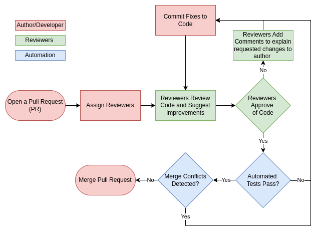

# Collaboration with GitHub

## Introduction

Although you should already be familiar with using GitHub, this week we'll go into detail on using its full set of features. This should improve your efficiency as a team and allow you to improve the quality of your code.

> [!TIP]
> Every time you see a task in the workbooks, add it as an issue in your [Kanban board](https://github.com/spe-uob/SEP2025/tree/main/Weekly%20Workbooks/02%20Software%20Processes#task-5-set-up-your-kanban-board-and-add-your-first-issues)!
> You can decide how to action it in the next team meeting, but this way you won't lose it. 

#
## Pull Requests (PRs) and Code Review

**[Pull Requests (PRs)](https://docs.github.com/en/pull-requests/collaborating-with-pull-requests/proposing-changes-to-your-work-with-pull-requests/about-pull-requests)** are a tool supported by GitHub and other remote repository platforms which allow a team to ensure that new changes are checked and other team members approve before being merged into another branch. 

We recommend you set up a **[Pull Request Template](https://docs.github.com/en/communities/using-templates-to-encourage-useful-issues-and-pull-requests/creating-a-pull-request-template-for-your-repository)** from the start, so you can have a standard format that includes everything you need.  Have a look at previous teams' repos, and ask your mentor to show you theirs, to get inspiration. 

**To open a PR**, go to the Pull Requests tab on your repository on GitHub and select 'New Pull Request'. Then select the branch that you want to merge to and from and click 'Create pull request'. This will open a page which allows you to browse and discuss changes in order to perform a ***code review***. 

Usually 1 or 2 people are assigned to review changes from feature branches and most, if not all of the team, are assigned when merging into main. It will also run automated tests setup via GitHub Actions (we will go into detail on setting this up next week) and detect merge conflicts. 

The flowchart below shows this workflow. Start to use Pull Requests when merging features into dev and when merging dev into main.

The Week 4 lecture will focus on how to do code reviews well - **if you miss the lecture**, make sure you watch it on Re/Play in the unit Blackboard.  We also have an [article about Code Reviews in the Knowledge Hub](https://github.com/spe-uob/knowledge-hub/blob/main/Code_Review.md) written by mentor [Edward Clarke](https://github.com/EdwardC1104) that we recommend you read - and an article about [Writing code for others](https://github.com/spe-uob/knowledge-hub/blob/main/Writing_Code_For_Others.md) by mentor [Clarissa Ch'ng](https://github.com/clarissachng) based on her internship.

> [!TIP]
> It can be difficult having your code reviewed by peers for the first time, but try really hard not to take offence at code reviews. 
>  
> If your code reviews get accepted with no changes, they haven't been done properly! It's completely normal for PRs to go backwards and forwards 4 or 5 times with different changes before they are accepted. Treat your reviewers' comments as information to help you improve.
>  
> Similarly, when you're reviewing team-mates' code, don't be afraid to reject it if there are errors. It may feel uncomfortable at first, but you are helping them when you ask them to make changes.
>  
> Above all, **be kind** to each other, whether you're reviewing or responding to comments, and don't take code reviews personally!

## Principles of code reviews within SEP

In SEP we will shortly be setting your repo so nothing can be merged in without being reviewed by 2 team mates. This can cause problems when team-mates wave code reviews through without looking at them properly. This happens for a few reasons:

* Team mates are unconfident and don't know how to approach code reviews.
* A team mate has committed a very large code dump that would take a huge amount of time to review, and the reviewers don't know where to start.
* The code is not laid out well, and lacks comments, so it's hard to tell what's going on.
* The team is coming up to a deadline and anxious to get the code merged as fast as possible.

These all cause problems, as mistakes are missed, sending you into [merge conflict](https://docs.github.com/en/pull-requests/collaborating-with-pull-requests/addressing-merge-conflicts/about-merge-conflicts) hell.  

### You do  not have to review issues that are too big
In SEP **you are NOT expected to review something just because a team mate has committed it**.  If a commit is too big and unwieldy, you are **expected** to reject it, and ask that it be re-committed in smaller, more manageable chunks, broken down into smaller PRs that contain features or sub-features. This means the work can be split across team mates.

**It is good practice** to be making smaller commits/PRs regularly, rather than working for a number of weeks on a feature and only committing when it is 'ready', as you won't be able to spot issues.  For example, if you're working on a frontend, rather than committing the whole frontend, work on and commit, PR and merge one feature, and when you know that works, commit the next.   

As a very rough average, you shouldn't have more than 2 PRs per person open a week and each of those shouldn’t be more than ~200 lines changed (depending on the task, of course).

**If your code gets rejected for being too large**, and you don't know how to break it down into smaller PRs, ask your mentor for advice, come to the drop-ins or ask the TAs in the workshops.

### Make sure your team mates know when you're planning to commit
As part of your regular [standups](https://github.com/spe-uob/SEP2025/tree/main/Weekly%20Workbooks/02%20Software%20Processes#agile-development) you should be keeping team mates up to date with what you are working on and when you'll want it reviewed. It's best to under-promise and over-deliver - so if you think it will be ready by Friday, for example, tell them it will be done on the following Monday! 

### Make sure the review turnaround time is realistic!
If a team mate is expecting you to be working through the night, over the weekend or when you have other commitments, it's fine to say no - tell them when you *can* review it by.

### Don't expect to be merging code on the day of a deadline!
If you have a deadline, whether it's a large one like the MVP/Beta/Final releases/vivas, or a smaller one such as the testing days or a client meeting, plan to have a [code freeze](https://en.wikipedia.org/wiki/Freeze_(software_engineering)), where nothing new is added or changed to the dev branch, at least 24 hours in advance. Last minute changes almost always cause chaos!

### Agree in advance who will be reviewing and when
Respect that team mates won't be able to review straight away.  If you commit earlier than you thought, they may not be able to review it earlier, but will still stick to the agreed timeframe. 

### If you struggle with reviewing code, tell your team!
You are **all** expected to be reviewing code - if you find it difficult, ask team mates to pair-review, [pair programming](https://gds.blog.gov.uk/2018/02/06/how-to-pair-program-effectively-in-6-steps/) style. If you're still struggling, come to the drop ins, or ask a TA in the workshops. 

**It is always better to not merge code into the project and miss a deadline, than to merge it without it being reviewed properly!**

#
## Third-Party Connections

Some third-party applications use APIs to interact with GitHub to improve your workflow or enable additional features. For example, GitKraken and JetBrains IDEs both use the GitHub API to improve workflows - these have already been granted permission. 

**If you come across a third-party application that you'd like to use**, it needs to be approved by one of the Lead TAs or Teaching Staff during the setup process. If this is the case, please [email Sarah Connolly](mailto:sarah.connolly@bristol.ac.uk ) so we can approve your request promptly. 

More info on third-party connections can be found [here](https://docs.github.com/en/apps/oauth-apps/using-oauth-apps/connecting-with-third-party-applications).

#
## Task 1: Make sure you have a `dev` branch
Once you have a `dev` branch, we'll set it to default - and from next week, this is what we'll be using to give you repo feedback.  

Ensure your `dev` branch is always up-to-date, and that it is **never** behind `main`!

> [!WARNING]
> Work that is not in *dev* does not exist in the marking - we can only mark what we can see!

