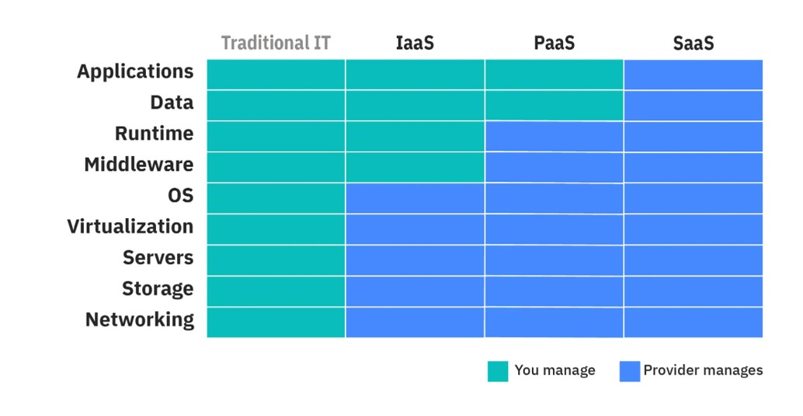

# Containers and Cloud
This week we will learn about containers, an extremely successful virtualisation technique that is key to the deployment of your application, and about Cloud in general and AWS services in particular. 

## Containers

### Task 1: Introduction to Containers 

<table><tr><td> <h3>What are Containers?</h3>

Containers are packages of software that have everything someone needs to run your system in the cloud - code, libraries, system tools, configuration files and anything else needed.

They're created to enable anyone to be able to run and deploy your system from anywhere, making it portable and not reliant on specific operating systems.  

 They are resource-efficient can be used in different ways - you may have your whole software system in one container, or divided between a number of different containers. 
 

 

</tr></table>

**Please watch these two short videos:**

* an [introduction to containers](https://uob.sharepoint.com/:v:/t/UnitTeams-COMS20006-2021-22-TB-4-A/EfaHnCJKChNf6G-WRrzsZ_YBWNdKPljaOxW7rARLVC48UQ?nav=eyJyZWZlcnJhbEluZm8iOnsicmVmZXJyYWxBcHAiOiJTdHJlYW1XZWJBcHAiLCJyZWZlcnJhbFZpZXciOiJTaGFyZURpYWxvZy1MaW5rIiwicmVmZXJyYWxBcHBQbGF0Zm9ybSI6IldlYiIsInJlZmVycmFsTW9kZSI6InZpZXcifX0%3D&e=Dpx318)  to
find out the main concepts
*  [a demonstration](https://uob.sharepoint.com/:v:/t/UnitTeams-COMS20006-2021-22-TB-4-A/EaBpY4vgJr1TjzEbrNz-o0YBFHV9E4hICB3k1hRliK1alw?e=ueZEj0&nav=eyJyZWZlcnJhbEluZm8iOnsicmVmZXJyYWxBcHAiOiJTdHJlYW1XZWJBcHAiLCJyZWZlcnJhbFZpZXciOiJTaGFyZURpYWxvZy1MaW5rIiwicmVmZXJyYWxBcHBQbGF0Zm9ybSI6IldlYiIsInJlZmVycmFsTW9kZSI6InZpZXcifX0%3D) how a Spring application can be dockerised. .

These are focused on Spring web applications, but if you are not making your product with Spring, you should still watch them to learn the key concepts.  

# 
### Task 2: Install Docker

We recommend you use [Docker](https://www.docker.com/) for containerisation. 

They have great documentation - [start here](https://docs.docker.com/get-started/get-docker/) to install the client designed for your system, and if you need any guides, advice or other information, you can probably find it on [DockerDocs](https://docs.docker.com/).

# 
### Task 3: Run Hello World

With the docker client working on your system you can now take the first steps: 

* enter `docker run hello-world`. 
* If everything goes to plan, you should see a message on the terminal. 
* A call to `docker ps` should not show anything as the container exits immediately.
* However, you can run `docker images` to find the name of the image and then call `docker inspect <ref>` with the name of the image to see some metadata.  

# 
### Task 4: Dockerise a Spring Boot App

The final step is to dockerise a Spring Boot app. 

If your team is working on a Spring Boot app, now should be the moment to put that into a container. If not, you might want to dockerise the example from the practical introduction video

The code can be found on github under [https://github.com/spe-uob/spring-hello-world](https://github.com/spe-uob/spring-hello-world).

Recall the steps we took in the practical video and you should have it running in no time:
* build the app jar with `mvn package`
* find the path to the jar from the target folder
* check the base image in the Dockerfile matches your local Java version
* run `docker build` and finally `docker run`.

See the video for the full commands.  

# 
## Docker and React
[Murray Groves](https://github.com/MurrayGroves) has written a great [guide to Docker, React and Reverse Proxies](https://github.com/spe-uob/knowledge-hub/blob/main/React%20-%20Docker%20and%20Reverse%20Proxies%20for%20Development%20&%20Production.md) for the [SEP Knowledge Hub](https://github.com/spe-uob/knowledge-hub/), which we recommend if you're using React. 

# 
## Cloud and AWS

Most of you will want to use Cloud services in some way.  We use Amazon Web Services Cloud.  But there are some important things to remember, especially in how to set up your Cloud system. 

### Different types of Cloud services

In SEP, you will be using IaaS or PaaS

#### Infrastructure as a Service (IaaS):
Virtual machines, storage, and networking resources are available for you to manage and configure as needed. It's like having a virtual data centre in the cloud. 
With IaaS you can configure and control the infrastructure, install and manage software and have full control over your resources as if you were managing physical hardware, without the need to maintain it.

#### Platform as a Service (PaaS): 
AWS provides pre-configured platforms for application development, reducing the need to manage underlying infrastructure. Examples include AWS Amplify for web applications and AWS Lambda for serverless computing.

With PaaS, on top of IaaS tools, tasks such as operating system management, scalability and security are managed for you.

#### Software as a Service (SaaS): 
AWS does not specialize in offering SaaS. The most well-known example would be Microsoft’s Azure. Azure hosts and manages software applications that users can access over the internet, such as Office 365.

With SaaS, fully fledged software is delivered to the end-user/developer, usually through a browser.

# 
###  AWS briefing - services you can use with AWS Cloud

**Please read these slides!**  These lay out different services AWS provide for you and when you might use them. 

As always, if you can't open the slides in the workbook, click into the [resources folder](https://github.com/spe-uob/SEP2024/tree/main/Weekly%20Workbooks/07%20Containers%20and%20Cloud/resources) of this workbook and download the slides: CLOUD.pdf

#
###  AWS briefing - how to set up your Cloud account
  
 

**Please read both sets of slides!** These include an overview of the AWS services, what resources you have available to you and instructions on how to set up your account.  

As above, if you can't open the slides in the workbook, click into the [resources folder](https://github.com/spe-uob/SEP2024/tree/main/Weekly%20Workbooks/07%20Containers%20and%20Cloud/resources) of this workbook and download the slides:  AWS1.pdf and AWS2.pdf. 

> [!IMPORTANT]
> **DO NOT SPEND YOUR OWN MONEY ON SEP!!**
>
> **DO NOT PUT YOUR CREDIT/DEBIT CARD DETAILS INTO AWS! !**

# 
### To set up your Cloud account

Technical Services have [a page on their Blackboard](https://www.ole.bris.ac.uk/webapps/blackboard/content/listContentEditable.jsp?content_id=_9948566_1&course_id=_238502_1) where one team member can request your Cloud account (you must be logged into Blackboard).  Watch their induction, and complete the form.  You just need to say something like:

> *I am a student on COMS20006 Software Engineering Project, and my team are making [eg a web app to do X].  My Unit Director, Sarah Connolly, has said that we need AWS Cloud for this and asked that I request it.*  
>
> *The team members using this account will be:*
> 
>*[name] [username]*
> 
>*Thanks very much*

Where it asks you to input supervisor details, Sarah Connolly, email sarah.connolly@bristol.ac.uk .⁠

Once your AWS account is set up, you will have a budget set for you. This will be monitored, and if you exceed your budget, you will have **restrictions** placed on your account, but your work will not be deleted. 

**If you realise you will exceed your budget [email the Unit Director](mailto:sarah.connolly@bristol.ac.uk) immediately.** 

As the **first cloud task**, give your team mates admin access to it - you don't want to risk the person with the Cloud key getting £500,000 from Y Combinator (as an example!) and leaving uni, taking the only access to the Cloud away!

> [!WARNING]
> **You will have a limited AWS budget and are responsible for spending these wisely**
>
> **NEVER add your own credit/debit card!**  Almost all activities use credit - it is very easy to build up charges
>
> **Remember to delete resources that are not in use, so you don't get charged for them!**

