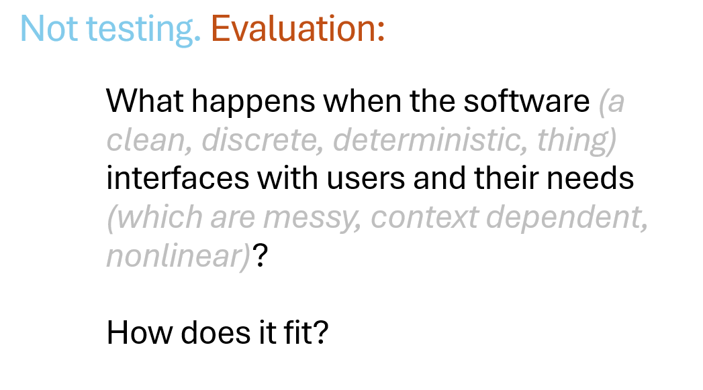
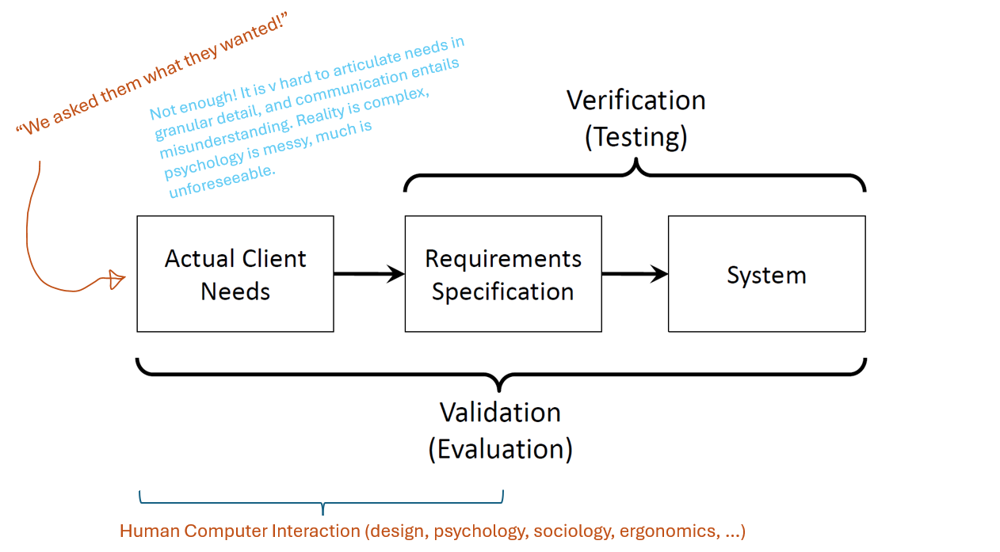
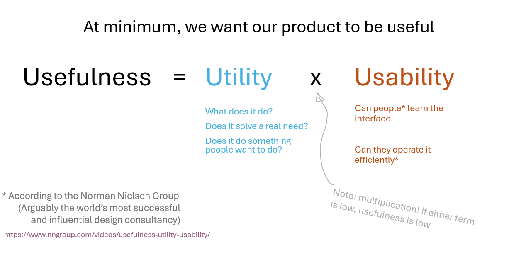
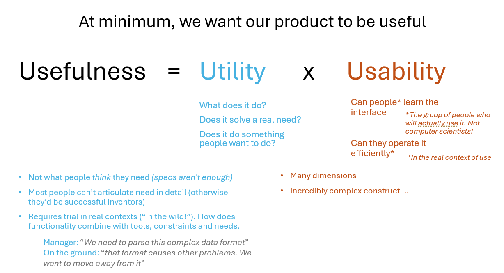
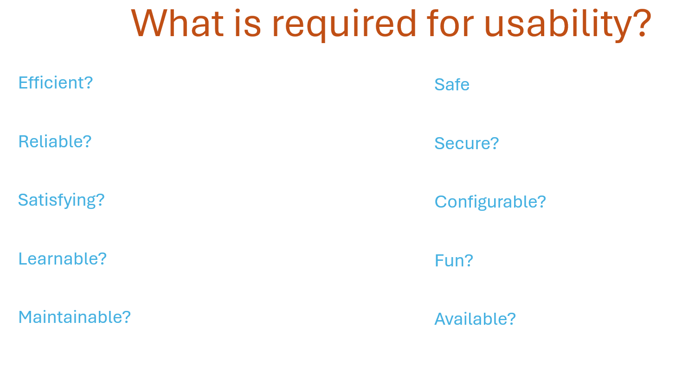

## Product Evaluation

### Task 1: Introduction
By the end of your project, your client will have been in receipt of a number of incremental versions of your product. As with any mature development process, critical reflection and constant process improvement is of upmost importance. In order to support this, it is essential to be able to evaluate the quality of each release of your system. 

This is not testing, which you have already done. It is EVALUATION:

Evaluation means addressing how the *actual* needs of the client match with both the specification, and  the system you have built to that specification. Evaluation most immediately critiques the implemented system, but may thereby critique the specification also. Your product may match the specification perfectly, but still be bad for users: in that case it is possible the specification itself is lacking in some ways. It is great that you asked the clients what they need, and great that you recorded it carefully in a specification then followed it to the letter. Unfortunately it is hard for the client to articulate (or even know!) what they actually need in granular detail. Certain key details may have been missing entirely! Different users and managers will have different ideas. Reality is messy and hard to anticipate and describe. So we need to do real-world evaluation.

# 

### Task 2: Utility, Usability and Usefulness
Although a fairly abstract concept, "Usefulness" provides us with a handy construct with which to gauge the success of a project. 

Take a look at this short video about usefulness https://www.nngroup.com/videos/usefulness-utility-usability/

Here's a little more detail about what *utility* and *usability* involve.

# 

### Task 3: What does "Usability" involve?
Usability is complex concept. It includes a range of different aspects. In different situations some of these aspects will be more important than others. For an air-traffic control system, "safety" and "reliability" are paramount. For other technologies "learnability" may be most important.  It is important to identify the most relevant aspects of usability for your product.

To aid you in gaining appreciation of its range and breadth, consider the grid of concepts in the diagram below. For each concept, ask yourself "Is is Usability" - does it fall under the umbrella of usability, or does it fall outside the main area of concern. This is answered in the lecture - try to come to your own conclusions before attending (or viewing) the lecture.   

# 

### Task 4: Approaches to Usability Evaluation
There are a wide variety of approach available to help us in assessing the usability of a system. These slides describe a number of options for evaluating usability. This covers both *quantitative* and *qualitative* approaches. As you read think about which of these different aspects are most relevant to the system that you are developing as part of your group project.

# 
### Task 5: Writing Good Questions
Many of the approaches in the slides for Task 4 rely on asking questions (e.g. questionnaires and interviews) . The quality of the questions is very important and harder than it looks to get it right. Bad questions can be a waste of time and will not result in a useful evaluation. In the worst case they will mislead you about the real issues. These slides explain a number of cases of bad questions. In the next task you will get the opportunity to test the knowledge that you gain here ! 

 

# 
### Task 6: What is wrong with these questions

Take a look at the following list of sample questions. Using the knowledge you gained in the previous section, consider each question carefully and decide if it falls foul of any of the problems outlined previously. Hover your mouse over the [Answer] underneath each question to reveal possible problems. Note that this is a complex area and there may be more than one problem with a particular question.

1. Does the GitHub “Projects” Kanban board help Lecturers and Students to monitor the project progress ?

2. Can all types of issue be represented by the currently available set of labels (i.e. bug, enhancement, question etc) ?

3. How easily apparent is the process for labelling issues with the currently provided set of labels (i.e. bug, enhancement, question etc) ?

4. Will the contribution analytics features of GitHub allow for more accurate assessment of individuals performance at the end of the unit ?

5. Do the commit analysis features of GitHub provide additional transparency into progress of projects ?

6. Does the amount of information that teams are required to capture and record cause an unnecessary additional burden on team members ?

7. Would assessing individual contribution be easier using peer assessment, instead of looking at Github metrics ?

8. Is it the case that the amount of work required to set up a suitably detailed set of test cases has caused you team defer unit testing until a later stage in the project ?

9. Do the sophisticated process support features of GitHub projects enable teams to successfully manage their work ?

10. On the GitHub Kanban board, do you find it a useful feature to be able to create “notes” first (before converting them into fully fledged “Issues”) ? 

  

# 
### Task 7: Analysing and Interpreting
Data alone is useless. If you capture a load of data using the methods above, you need to turn it into knowledge. This requires interpretation. For the quantitative data you can use the methods taught by Anne Roudaut in the statistics module - visualising and comparing values. For the qualitative data things are a bit different, you need to take different approaches to analysis. You need to plan this analysis even before you start the interviews, in order to help guide your attention. These slides introduce qualitative analysis.

 

# 
### Task 9: Which approaches will you use

Reflect upon all of the tools and techniques outlined in this workbook. In your teams, discuss and identify the approaches that are most relevant and appropriate to your project. The chosen approaches will depends upon the nature of your project:

- The type of system being built
- The type of interaction you are studying
- Your level of access to your client
- Availability of “good” users (quality, co-location etc)

You should also take care to consider pragmatic issues including the amount of time have you have to undertake evaluation in order to identify the most cost-effective activity for that time-frame.  

# 
