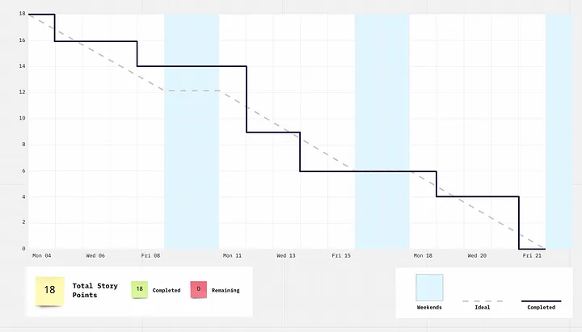

# Agile Development

## Introduction

Up until this point, we have only just provided an overview of Agile Development. Accordingly, our expectations of Agile implemented within your team process have been low. After attending the lectures and completing this workbook, you should have a much more in-depth understating not just of the theory of Agile but also the point of it. 

Agile can be a difficult topic to really get the point of if it's not experienced in practice. Understanding the theory alone will only leave you with a collection of buzz words to throw around! I thoroughly encourage you to humour the tasks in this workbook and make sure to have a go at them.

Over the rest of the unit, we would like you to take the theory of Agile delivered in this week's lectures and apply them to your project. Starting in the next sprint, you should start to structure your meetings and process with the following activities. 

We understand that always completing scheduling each Agile ceremony is time consuming, therefore, we don't expect you to do them all the time. However, do try them at least once to see which are and aren't helpful to your team.

#
### Task 1: Backlog Refinement

A *product backlog* in Agile is a list of all the tasks required to complete the product or sometimes just those in the forseeable future. 

This is roughly analogous to the tasks into currently in your 'To Do' section on the Kanban. These tasks will vary significantly in granularity. Tasks are initially large with a loose definitions and are split into smaller tasks and defined with more specific definitions as they are *refined*. This allows supports the uncertain nature of project work, where the tasks further in the future are less understood but become clearer as time goes on.

*Backlog Refinement* is the Agile ceremony (meeting) where the product backlog is refined to produce smaller manageable tasks from larger ones. These tasks are given testable and well defied goals which allow them to be evaluated against the *[Definition of Done](https://www.atlassian.com/agile/project-management/definition-of-done)*. 

Refined tasks are also given *[story points](https://www.atlassian.com/agile/project-management/estimation)* which are a measure of how large the task it. 

There are multiple ways to do this but a popular one is *Planning Poker*. This happens during the backlog refinement meeting once the goals of a refined new task have been defined and all team members understand the scale and risk of the task. Then, each member of the team secretly selects a card with a value that is a score of the effort that they believe it will take. A typical scale is 'developer days' but agree as a team on a scale that you think will work well. 

Once everyone has selected a card, they are revealed at the same time. If all cards are equal then that becomes the *story points* for that task. If a consensus is not reached then the task must be discussed again before redrawing cards until a consensus is reached. 

A caveat is that all cards are values from the Fibonacci scale. This allows developers to not get het up on the exact value and take it as a rough guide. There are lots of great [online tools for planning poker](https://planningpokeronline.com/).

Backlog refinement meetings are usually carried out at a set point during the sprint but can be more frequent as needed. Try and hold a backlog refinement meeting in your team. 

#
### Task 2: Sprint Planning

At the beginning of every sprint a *Sprint Planning* ceremony is held to take items within the backlog and move them to within the sprint tasks. The number of tasks brought into the sprint is determined by a prediction of how many *story points* a team is able to complete and the assigned story points of the tasks. 

Of course, if you are doing this for the first time then you will not have a good understanding of how many story points you can reasonably complete within a task - to begin with just make a reasonable estimate based on your experience so far. As the sprints go on, you can build up a rolling average of how many story point you complete and that should be the number of new story points that you bring into the sprint. 

If you complete tasks quickly then its absolutely ok to bring in more refined tasks during the sprint.

#
### Task 3: Sprint Review

At the end of every sprint a *Sprint Review* ceremony is held to recap and discuss all the work that was undertaken within the sprint. An agenda could look like:

- Overview of the sprint. Have all goals been met? Update the status of each current task.
- Review of key metrics. Are we being predictable and keeping on track?
- Feature demos. Have the team review and completed features so they can be merged.

Ensure that the SCRUM master leads the meeting to make sure you efficiently get through the agenda. Sometimes these meetings are held back to back with the Sprint Planning ceremony.

#
### Task 4: Sprint Retrospective

A *Sprint Retrospective* (AKA retro) is held at the end of every sprint, or every other sprint, or sometimes when teams feel like their are team process which need addressing. It is similar to a sprint review but instead focusses on analysing and improving **teamwork** and **processes**. In order that teams can be fully open and transparent with each other, usually, companies will hold this without their manager being present. 

There are a few formats to achieve an effective retrospective but one strategy is centres around the 4 Ls:

- Loved
- Longed For
- Loathed
- Learned

Use a whiteboard, postit notes or a digital tool like [Miro](https://padlet.com/)/[Padlet](https://padlet.com/) to allow all team members to contribute at once. Allow time at the start, around 5-10 minutes, for each team member to write and post in each category. Then the SCRUM master should lead the discussion through each point with the goal of understanding why this was helpful or detrimental to the team. 

Ultimately, these discussions should generate concrete **actions** that the team plans on doing to improve their processes. These could be "schedule pair programming time between X and Y team members" or "Ask X for help in obtaining resources for a task". You should put these items on your kanban board.

#
### Task 5: Predictability Assessment

While working through a project, it is important that we are not only *productive* but also *predictable*. For a software team, this means being able to take into each sprint a realistic number of story points. This allows managers to track and plan a project in the long term, which is especially important in large organisations where multiple teams are all working on many small parts of a project.

One method of doing this is to keep a log of the number of story points planned for in a sprint and the number actually completed. This allows the team to adjust how many story points they bring into future sprints to improve their predictability over time.

Another method of ensuring work is evenly completed within a sprint and you are on track to complete all tasks is to use a burndown chart. This shows the ideal and actual completion of story points over the course or a sprint.

#
### Optional Further Reading

- [Agile Manifesto](https://agilemanifesto.org/)
- [Atlassian: The Agile Coach](https://www.atlassian.com/agile)
- [Agile Metrics](https://www.leadingagile.com/2013/07/agile-health-metrics-for-predictability/)

# Team Reset

### Task 6:  TB2 Team Reset

Using these principles, think about how TB2 went, and have a meeting dedicated to evaluating TB1 and looking forward to TB2.  

Questions you might want to ask yourselves:
* What went well last TB that you want to do more of? (What do you love, what have you learned?)
* What could have gone better?
* Are there any ways you were working that you could improve (for example, if you are split into front & backend sub-teams, could you change this for TB2?)
* How can we work differently? 

This is a difficult task - these conversations are hard! But this is an important life skill, and will be great to talk about in the final viva and in job interviews.  

> [!NOTE]
> You need to approach this in the right frame of mind. This is not about accusing team mates of being bad students - it's about being open and honest about what you're seeing.  Try to keep the discussion focused around outcomes - for example, "When I ask a question in the team and no one answers, it makes it hard for me to know if I should wait for an answer or just decide myself"
>
> Try not to feel defensive or criticised. Don't feel you have to justify why things did or didn't happen - focus on what you could do differently.

**If you want help with these kinds of conversations, we can help!** [Email Sarah](mailto:sarah.connolly@bristol.ac.uk) and we can arrange for an academic to mediate your meetings.  

<table><tr><td>
<b>Example:  No one is completing code reviews, which means work is being held up.</b>

The problems are:
* The team is using WhatsAPP to communicate, so when students put a note in to say the review is ready, it is getting lost
* No one knows who should be doing the reviews as it has not been discussed
* The team is divided into a 'frontend' and 'backend' team, and students think they shouldn't review things from the other side

Solutions:
* The team moves to something like Discord and Teams, and set up notifications for this team only
* Everyone in the team commits to checking the channels twice a day
* Everyone in the team commits to putting a thumbs up emoji when then have seen a post, and if a question is asked, everyone answers it, even if the answer is 'I can't, I'm sick' or 'I don't know how to'
* The team re-factors so everyone is able to work on every part of the code
* In the SCRUM meetings, plan who will be available to do code reviews on which days
* Do more work together as a team, either in person, or on the same call, with microphones off, so when someone is ready for a code review, they can tell the team mates straight away
* Anyone who is unconfident about code reviews tells their team mates, and do a code review as pair programming
</tr></table>

Remember to make notes of everything you agree - and tell us how you changed your working practices in the vivas!  Realising you were working inefficiently and changing the ways of working is a great way to get marks!

Once you have had this meeting, leave negativity behind you in TB1, and move forward, positively. If you have problems you think are serious, or have team mates who are not engaging, [email Sarah](mailto:sarah.connolly@bristol.ac.uk) and we will try to get them help. 

### Task 7:  Project Management
Make a Gantt Chart and plan how you are going to get to the Teaching Block, and how many sprints you'll have.  What do you want to achieve? How and when are you planning to release to the client? Breaks this down into Agile sprints.

As part of the team reset, think about how you are managing the team.  Is there a clear Project Manager?  Or has 1 member of the team taken on this role without it ever being defined?  

One suggestion is to write down all the project management tasks, and define the role for TB.  You can have 1 team member as Project Manager for the TB, or you can rotate the role, so different students project manage the different sprints.  Rotating the PM role may mean you are a little bit slower, as you need to get used to working practices - but if you explain this in the viva, it is a good way to impress the markers - and it also is something that can be great to talk about in interviews.  

